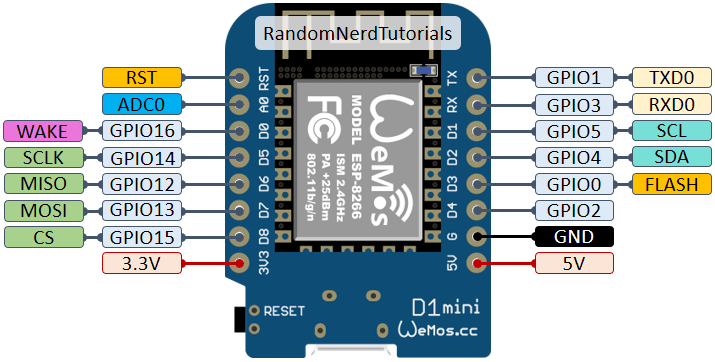
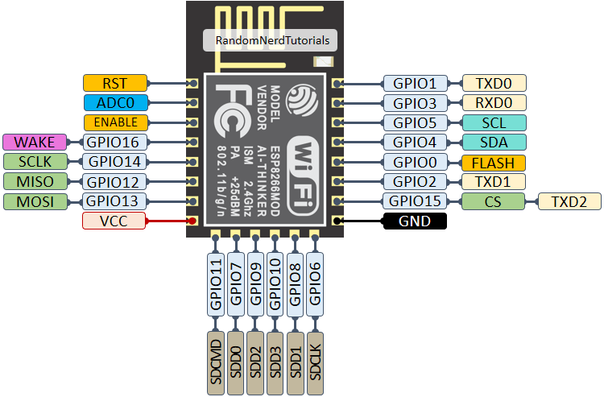

# Hardware Guide | Water Quality Monitor

This guide provides comprehensive information for building the Water Quality Monitor hardware, from selecting parts to assembling the complete device.

> **\u26a0\ufe0f Status: Under Development** \u2014 This module is in the planning phase. Hardware specifications may change as development progresses.

---

## \u2728 Overview

The Water Quality Monitor is designed to be a **modular, extensible** device for monitoring swimming pool water chemistry. The current design focuses on **pH and chlorine** monitoring, with the ability to add additional sensors in the future.

**Design Goals:**
- **Accuracy:** Reliable measurements comparable to commercial test kits
- **Reliability:** Robust operation in outdoor pool environments
- **Extensibility:** Easy to add new sensor types
- **Affordability:** Cost-effective compared to commercial systems
- **Integration:** Seamless integration with Smart Swimming Pool ecosystem

---

## \u26a1 Parts List (BOM)

### \u26a1 Core Components

| # | Component | Qty | Approx. Cost | Notes | Recommended Suppliers |
|---|-----------|:---:|:------------:|-------|----------------------|
| 1 | ESP8266 Development Board | 1 | 5\u201310\u20ac | WeMos D1 Mini or NodeMCU | [Amazon](https://amzn.to/2DPf0LJ), [AliExpress](https://www.aliexpress.com/) |
| 2 | pH Sensor with BNC Probe | 1 | 20\u201350\u20ac | 0-14 pH range, BNC connector | [14core](https://14core.com/), [AliExpress](https://www.aliexpress.com/) |
| 3 | pH Electrode Storage Solution | 1 | 5\u201310\u20ac | For electrode storage | [Amazon](https://www.amazon.de/s?k=pH+storage+solution) |
| 4 | pH Calibration Solutions | 2 | 10\u201320\u20ac | pH 4.0 and pH 7.0 | [Amazon](https://www.amazon.de/s?k=pH+calibration+solution) |

### \u26a1 Optional Components

| # | Component | Qty | Approx. Cost | Notes | Recommended Suppliers |
|---|-----------|:---:|:------------:|-------|----------------------|
| 5 | Chlorine Sensor | 1 | 30\u201380\u20ac | For chlorine monitoring | Various suppliers |
| 6 | Temperature Sensor | 1 | 5\u201310\u20ac | DS18B20 waterproof | [Amazon](https://www.amazon.de/s?k=DS18B20+wasserfest) |
| 7 | External ADC Module | 1 | 2\u20135\u20ac | ADS1115 for better precision | [AliExpress](https://www.aliexpress.com/) |
| 8 | OLED Display | 1 | 5\u201310\u20ac | SSD1306 or SH1106 | [AliExpress](https://www.aliexpress.com/) |
| 9 | I2C Multiplexer | 1 | 2\u20135\u20ac | For multiple I2C sensors | [AliExpress](https://www.aliexpress.com/) |

### \u26a1 Enclosure & Installation

| # | Component | Qty | Approx. Cost | Notes | Recommended Suppliers |
|---|-----------|:---:|:------------:|-------|----------------------|
| 10 | Waterproof Enclosure | 1 | 10\u201320\u20ac | IP65+ rating | [Amazon](https://www.amazon.de/s?k=IP65+Geh\u00e4use) |
| 11 | Cable Glands | 2\u20134 | 2\u20135\u20ac | For waterproof cable entry | [Reichelt](https://www.reichelt.de/) |
| 12 | Sensor Mount | 1 | 5\u201310\u20ac | For pH/chlorine probe mounting | [Amazon](https://www.amazon.de/) |
| 13 | Desiccant Packs | 2 | 2\u20135\u20ac | Prevent condensation | [Amazon](https://www.amazon.de/) |

### \u26a1 Tools Required

| Tool | Purpose | Notes |
|------|---------|-------|
| Soldering iron | Soldering components | 320\u2013350\u00b0C recommended |
| Solder | Electrical connections | Leaded for beginners, lead-free for RoHS |
| Flux | Improve solder flow | Rosin-core recommended |
| Wire cutters/strippers | Cut and strip wires | For hookup wire |
| Multimeter | Test continuity and voltage | Essential for debugging |
| Magnifying glass | Inspect solder joints | For quality control |
| Calibration beakers | Sensor calibration | 50-100ml capacity |
| Distilled water | Rinsing sensors | For calibration and cleaning |

### \u26a1 Total Cost Estimate

| Configuration | Approx. Cost | Notes |
|---------------|-------------|-------|
| **Basic (pH only)** | 40\u201380\u20ac | ESP8266 + pH sensor + enclosure |
| **Standard (pH + temp)** | 50\u2013100\u20ac | Adds temperature sensor |
| **Advanced (pH + chlorine + temp)** | 100\u2013200\u20ac | Adds chlorine sensor and ADC |
| **Complete (all sensors + display)** | 120\u2013250\u20ac | All sensors, display, premium enclosure |

---

## \u26a1 Sensor Selection Guide

### \u26a1 pH Sensors

We recommend the following pH sensors based on testing and community feedback:

#### \u2705 Recommended: 14core pH Sensor with BNC Probe

**Specifications:**
- **Range:** 0-14 pH
- **Resolution:** 0.01 pH
- **Accuracy:** \u00b10.1 pH
- **Response Time:** < 1 minute
- **Temperature Range:** 0-60\u00b0C
- **Output:** Analog voltage (0-3.3V or 0-5V)
- **Connector:** BNC
- **Probe Type:** Glass electrode with reference

**Pros:**
- Affordable price
- BNC connector for easy replacement
- Good documentation and support
- Compatible with ESP8266 ADC

**Cons:**
- Requires regular calibration
- Limited lifespan (1-2 years)
- Sensitive to temperature changes

**Resources:**
- [Product Page](https://14core.com/wiring-the-ph-power-of-hydrogen-ion-concentration-sensor-with-bnc-electrode-probe/)
- [Datasheet](14core.com-Wiring%20The%20pH%20Power%20of%20Hydrogen%20Ion%20Concentration%20Sensor%20with%20BNC%20Electrode%20Probe.pdf)
- [Wiring Guide](https://14core.com/wiring-the-ph-power-of-hydrogen-ion-concentration-sensor-with-bnc-electrode-probe/)

#### \u26a1 Alternative: Atlas Scientific pH Sensor

**Specifications:**
- **Range:** 0-14 pH
- **Resolution:** 0.001 pH
- **Accuracy:** \u00b10.01 pH
- **Interface:** I2C or UART
- **Probe Type:** Industrial glass electrode

**Pros:**
- Very high accuracy
- Digital interface (less noise)
- Robust construction
- Long lifespan

**Cons:**
- Expensive
- Requires specific circuit design

**Resources:**
- [Atlas Scientific pH Sensor](https://www.atlas-scientific.com/product_pages/sensors/ph.html)
- [I2C pH Circuit](https://www.atlas-scientific.com/product_pages/circuits/ezopmp.html)

#### \u26a1 Alternative: DFRobot pH Sensor

**Specifications:**
- **Range:** 0-14 pH
- **Resolution:** 0.1 pH
- **Accuracy:** \u00b10.1 pH
- **Output:** Analog voltage
- **Interface:** Gravity 3-pin connector

**Pros:**
- Good documentation
- Easy to use with Arduino/ESP8266
- Affordable

**Cons:**
- Lower accuracy than Atlas Scientific
- Requires calibration

**Resources:**
- [DFRobot pH Sensor](https://www.dfrobot.com/product-1025.html)
- [Wiki](https://wiki.dfrobot.com/SKU_SEN0161_Analog_pH_Meter_Pro_SKU_SEN0161)

### \u26a1 Chlorine Sensors

Chlorine sensor selection depends on your requirements and budget:

#### \u26a1 Option 1: Electrochemical Chlorine Sensor

**Specifications:**
- **Range:** 0-10 ppm (free chlorine)
- **Resolution:** 0.1 ppm
- **Accuracy:** \u00b10.5 ppm
- **Response Time:** < 2 minutes
- **Interface:** Analog voltage
- **Lifespan:** 1-2 years

**Pros:**
- Direct measurement
- Real-time monitoring
- Good accuracy

**Cons:**
- Requires regular calibration
- Limited lifespan
- Sensitive to temperature and pH

**Note:** Many electrochemical chlorine sensors require specific calibration procedures and may have cross-sensitivity to other chemicals.

#### \u26a1 Option 2: Optical Chlorine Sensor

**Specifications:**
- **Range:** 0-10 ppm
- **Resolution:** 0.1 ppm
- **Accuracy:** \u00b10.2 ppm
- **Interface:** I2C or UART
- **Lifespan:** 2-5 years

**Pros:**
- No calibration needed (factory calibrated)
- Long lifespan
- Less sensitive to interference

**Cons:**
- Expensive
- Complex optical design
- May require specific light sources

#### \u26a1 Option 3: DPD Colorimetric Method

**Specifications:**
- **Range:** 0-10 ppm
- **Resolution:** 0.1 ppm
- **Accuracy:** \u00b10.2 ppm
- **Interface:** Analog (color intensity)
- **Method:** Chemical reaction with DPD reagent

**Pros:**
- Standard method used in test kits
- Good accuracy
- Well understood chemistry

**Cons:**
- Requires reagent tablets or powder
- Manual process (unless automated)
- Reagents have limited shelf life

**Note:** DPD method can be automated with a peristaltic pump and colorimeter, but this adds significant complexity.

### \u26a1 Temperature Sensor (Optional)

**Recommended: DS18B20 Waterproof Temperature Sensor**

**Specifications:**
- **Range:** -55\u00b0C to +125\u00b0C
- **Accuracy:** \u00b10.5\u00b0C
- **Resolution:** 9-12 bits (configurable)
- **Interface:** OneWire
- **Waterproof:** Yes (stainless steel probe)
- **Cable Length:** 1m (standard)

**Pros:**
- Affordable
- Waterproof
- Easy to use with ESP8266
- No calibration needed

**Cons:**
- Requires pull-up resistor
- Limited to 12 sensors per OneWire bus

**Resources:**
- [DS18B20 Datasheet](https://datasheets.maximintegrated.com/en/ds/DS18B20.pdf)
- [Waterproof DS18B20](https://www.amazon.de/s?k=DS18B20+wasserfest)

---

## \u26a1 Circuit Design

### \u26a1 Basic Circuit (pH Only)

This is the simplest configuration for pH monitoring only.

```text
ESP8266 Development Board (WeMos D1 Mini)
   
   3.3V [ pH Sensor VCC ]
   GND [ pH Sensor GND ]
   A0  [ pH Sensor Output ]
   
   pH Sensor Board (14core)
   
   BNC Connector [ pH Electrode Probe ]
```

**Wiring Details:**

| ESP8266 Pin | WeMos D1 Pin | pH Sensor Pin | Notes |
|-------------|--------------|---------------|-------|
| 3.3V | 3V3 | VCC | Power (3.3V) |
| GND | G | GND | Ground |
| A0 | A0 | Output | Analog output |

**Important Notes:**
- Use **3.3V** power, not 5V (most pH sensors are 3.3V compatible)
- Keep wire lengths **as short as possible** to minimize noise
- Use **shielded cable** for the analog signal if possible
- Avoid running sensor cables parallel to power cables

### \u26a1 Advanced Circuit (pH + Temperature)

This configuration adds temperature monitoring for pH compensation.

```text
ESP8266 Development Board (WeMos D1 Mini)
   
   3.3V [ pH Sensor VCC ]
   3.3V [ DS18B20 VCC ] (via 4.7k\u2126 pull-up)
   GND [ pH Sensor GND ]
   GND [ DS18B20 GND ]
   A0  [ pH Sensor Output ]
   D2  [ DS18B20 DATA ] (OneWire)
   
   pH Sensor Board
   
   BNC Connector [ pH Electrode Probe ]
   
   DS18B20 Waterproof Sensor
```

**Wiring Details:**

| ESP8266 Pin | WeMos D1 Pin | Component | Notes |
|-------------|--------------|-----------|-------|
| 3.3V | 3V3 | pH Sensor VCC | Power |
| 3.3V | 3V3 | DS18B20 VCC | Power (via pull-up) |
| GND | G | pH Sensor GND | Ground |
| GND | G | DS18B20 GND | Ground |
| A0 | A0 | pH Sensor Output | Analog input |
| D4 | D2 | DS18B20 DATA | OneWire data (with 4.7k\u2126 pull-up to 3.3V) |

**DS18B20 Pull-up Resistor:**
- **Value:** 4.7k\u2126
- **Connection:** Between DS18B20 DATA line and 3.3V
- **Important:** Required for OneWire communication

### \u26a1 Complete Circuit (pH + Chlorine + Temperature + ADC)

This configuration adds chlorine monitoring and uses an external ADC for better precision.

```text
ESP8266 Development Board (WeMos D1 Mini)
   
   3.3V [ pH Sensor VCC ]
   3.3V [ Chlorine Sensor VCC ]
   3.3V [ ADS1115 VCC ]
   3.3V [ DS18B20 VCC ] (via 4.7k\u2126 pull-up)
   GND [ pH Sensor GND ]
   GND [ Chlorine Sensor GND ]
   GND [ ADS1115 GND ]
   GND [ DS18B20 GND ]
   
   SDA (D2) [ ADS1115 SDA ]
   SCL (D1) [ ADS1115 SCL ]
   
   ADS1115 Channel 0 [ pH Sensor Output ]
   ADS1115 Channel 1 [ Chlorine Sensor Output ]
   
   D4 [ DS18B20 DATA ] (OneWire)
   
   pH Sensor Board
   BNC Connector [ pH Electrode Probe ]
   
   Chlorine Sensor
   
   DS18B20 Waterproof Sensor
```

**Wiring Details:**

| ESP8266 Pin | WeMos D1 Pin | Component | Notes |
|-------------|--------------|-----------|-------|
| 3.3V | 3V3 | All sensors VCC | Power |
| GND | G | All sensors GND | Ground |
| D2 | D2 | ADS1115 SDA | I2C Data |
| D1 | D1 | ADS1115 SCL | I2C Clock |
| D4 | D2 | DS18B20 DATA | OneWire data (with pull-up) |

**ADS1115 Connections:**
- **A0** \u2192 pH Sensor Output
- **A1** \u2192 Chlorine Sensor Output
- **A2, A3** \u2192 Available for future sensors

**Benefits of External ADC:**
- **16-bit resolution** (vs 10-bit on ESP8266)
- **Programmable gain** (1x, 2x, 4x, 8x, 16x)
- **Differential inputs** for better noise rejection
- **Multiple channels** for multiple sensors

### \u26a1 Pin Assignment (WeMos D1 Mini)

| Function | ESP8266 Pin | WeMos D1 Pin | Notes |
|----------|-------------|--------------|-------|
| pH Sensor VCC | 3.3V | 3V3 | Power |
| pH Sensor GND | GND | G | Ground |
| pH Sensor Output | A0 | A0 | Analog input |
| Chlorine Sensor VCC | 3.3V | 3V3 | Power |
| Chlorine Sensor GND | GND | G | Ground |
| Chlorine Sensor Output | A0 | A0 | Analog (or use ADC) |
| DS18B20 VCC | 3.3V | 3V3 | Power (via pull-up) |
| DS18B20 GND | GND | G | Ground |
| DS18B20 DATA | GPIO2 | D4 | OneWire data |
| I2C SDA | GPIO4 | D2 | For ADC and I2C sensors |
| I2C SCL | GPIO5 | D1 | For ADC and I2C sensors |
| OLED SDA | GPIO4 | D2 | Shared with I2C |
| OLED SCL | GPIO5 | D1 | Shared with I2C |

**Note:** I2C is a **shared bus**, so multiple I2C devices (ADS1115, OLED, Atlas Scientific sensors) can share the same SDA/SCL pins.

### \u26a1 Pinout Diagrams

**WeMos D1 Mini:**



**ESP-12E/12F:**



---

## \u26a1 Assembly Instructions

### \u26a1 Step 1: Prepare Components

1. **Gather all parts** from the BOM
2. **Inspect sensors** for damage
3. **Test pH electrode** (if new, it may be dry; soak in storage solution for 24 hours)
4. **Prepare tools** and workspace

### \u26a1 Step 2: Breadboard Prototyping (Recommended)

**Best for:** Testing before permanent installation, learning the circuit.

1. **Place ESP8266 on breadboard**
   - Straddle the center gap
   - Ensure all pins are properly inserted

2. **Connect pH sensor**
   - Connect VCC to 3.3V rail
   - Connect GND to GND rail
   - Connect Output to A0

3. **Add DS18B20 (optional)**
   - Connect VCC to 3.3V rail (via 4.7k\u2126 pull-up resistor)
   - Connect GND to GND rail
   - Connect DATA to D4 (WeMos D1 Mini)

4. **Add ADS1115 (optional)**
   - Connect VCC to 3.3V rail
   - Connect GND to GND rail
   - Connect SDA to D2
   - Connect SCL to D1
   - Connect pH sensor to A0
   - Connect chlorine sensor to A1

5. **Verify connections**
   - Use multimeter to check continuity
   - Ensure no short circuits
   - Verify all connections are secure

### \u26a1 Step 3: Test Sensors

1. **Test pH sensor:**
   - Upload test firmware
   - Calibrate with pH 7.0 solution
   - Test with pH 4.0 and pH 7.0 solutions
   - Verify readings are stable and accurate

2. **Test DS18B20 (if installed):**
   - Upload test firmware
   - Place sensor in water
   - Verify temperature readings

3. **Test ADS1115 (if installed):**
   - Upload test firmware
   - Verify analog readings from both channels

### \u26a1 Step 4: Permanent Assembly

**Best for:** Final installation, outdoor use, long-term operation.

#### Option A: Perfboard

1. **Plan component layout** on perfboard
2. **Solder ESP8266** with pin headers for easy removal
3. **Solder sensor modules** with sufficient spacing
4. **Add screw terminals** for:
   - Power input (3.3V/GND)
   - Sensor connections
5. **Solder resistors** directly between pins
6. **Add test points** for debugging

#### Option B: Custom PCB

For production or multiple units, consider designing a custom PCB:

1. **Design schematic** using KiCad or Eagle
2. **Create PCB layout**
3. **Order PCB** from manufacturer (JLCPCB, PCBWay, etc.)
4. **Solder components** to PCB
5. **Test thoroughly**

### \u26a1 Step 5: Enclosure Assembly

1. **Prepare enclosure:**
   - Drill holes for:
     - Sensor cables (use cable glands)
     - Power input
     - Optional: Display window
   - Add mounting points for PCB/perfboard

2. **Install electronics:**
   - Mount PCB/perfboard in enclosure
   - Connect sensor cables
   - Add desiccant packs

3. **Install sensors:**
   - Mount pH electrode in sensor holder
   - Position chlorine sensor (if applicable)
   - Route cables through cable glands

4. **Seal enclosure:**
   - Ensure all cable glands are tight
   - Check for waterproof integrity
   - Test with water spray (if possible)

---

## \u26a1 Sensor Installation

### \u26a1 pH Sensor Installation

**Location:**
- Place sensor in pool water, **away from returns and skimmers**
- **Depth:** 30-50 cm below surface
- Avoid placing near **pump intakes** or **heaters**
- Ensure good **water circulation** around sensor

**Mounting Options:**

1. **Floating Mount:**
   - Sensor floats on surface
   - Easy to install and remove
   - May be affected by surface debris

2. **Wall Mount:**
   - Sensor mounted to pool wall
   - Stable position
   - Requires drilling

3. **Weighted Base:**
   - Sensor rests on pool floor
   - Stable position
   - May collect debris

**Cable Routing:**
- Use **waterproof cable** for external installations
- Keep cable runs **as short as possible**
- Use **cable ties** for strain relief
- Avoid **sharp bends** or **pinching** cables
- Route cables **away from pool edges** to prevent damage

### \u26a1 Chlorine Sensor Installation (if applicable)

**Location:** Similar to pH sensor

**Considerations:**
- May need **separate enclosure** if using DPD method
- **Protect from direct sunlight**
- Ensure **good water flow** around sensor
- Avoid **chemical feed points** (can cause false readings)

### \u26a1 Temperature Sensor Installation (if applicable)

**Location:**
- Same location as pH sensor (for temperature compensation)
- Or in **return line** for average pool temperature

**Mounting:**
- Use **sensor holder** or **weighted base**
- Ensure sensor is **fully submerged**
- Protect from **direct sunlight**

---

## \u26a1 Power Supply

### \u26a1 Power Requirements

| Component | Voltage | Current | Notes |
|-----------|---------|---------|-------|
| ESP8266 | 3.3V | ~80mA (active) | ~20mA (sleep) |
| pH Sensor | 3.3V | ~10mA | |
| Chlorine Sensor | 3.3V | ~10mA | Varies by sensor |
| DS18B20 | 3.3V | ~1mA | |
| ADS1115 | 3.3V | ~1mA | |
| OLED Display | 3.3V | ~20mA | |
| **Total (Active)** | **3.3V** | **~120mA** | |
| **Total (Sleep)** | **3.3V** | **~30mA** | Without display |

### \u26a1 Power Options

| Option | Pros | Cons | Recommended |
|--------|------|------|-------------|
| **USB Power** | Simple, widely available | Requires outlet nearby | \u2705 For indoor/testing |
| **USB Power Bank** | Portable, no wiring | Limited runtime | \u2705 For temporary setup |
| **5V Power Supply** | Stable, continuous | Requires wiring | \u2705 For permanent install |
| **Solar Power** | Autonomous, no wiring | Complex, weather dependent | \u26a1 For advanced users |
| **Battery + Solar** | Best of both worlds | Most complex | \u26a1 For remote locations |

### \u26a1 Solar Power Option

For **autonomous operation**, consider solar power:

**Components:**
- **Solar Panel:** 5V/2W (for continuous operation)
- **LiPo Battery:** 3.7V/2000mAh (for night operation)
- **Charge Controller:** TP4056 module
- **Boost Converter:** MT3608 (3.7V to 5V)

**Circuit:**
```text
Solar Panel (5V) [ TP4056 Charge Controller ]
                                  |
LiPo Battery (3.7V) [ MT3608 Boost Converter ]
                                  |
ESP8266 (5V input) [ AMS1117 3.3V Regulator ]
                                  |
All Sensors (3.3V)
```

**Considerations:**
- **Panel size:** 2W panel provides ~400mA in full sun
- **Battery capacity:** 2000mAh lasts ~16 hours at 120mA
- **Deep sleep:** Use deep sleep to extend battery life
- **Enclosure:** Ensure panel and battery are protected

---

## \u26a1 Maintenance

### \u26a1 Regular Maintenance Schedule

| Task | Frequency | Notes |
|------|-----------|-------|
| **Clean pH electrode** | Weekly | Rinse with storage solution |
| **Calibrate pH sensor** | Monthly | Use pH 4.0 and 7.0 solutions |
| **Check chlorine sensor** | Monthly | Verify readings with test strips |
| **Inspect enclosure** | Monthly | Check for water ingress, condensation |
| **Test MQTT connection** | Monthly | Verify data is being published |
| **Replace pH electrode** | Annually | Or when readings become unreliable |
| **Replace calibration solutions** | Every 3-6 months | Or when contaminated |
| **Check power supply** | Quarterly | Verify stable voltage |
| **Inspect cables** | Quarterly | Check for damage or wear |

### \u26a1 pH Sensor Maintenance

**Cleaning:**
1. Remove sensor from pool
2. Rinse with **distilled water**
3. Gently clean electrode with **soft cloth**
4. Soak in **storage solution** for 1 hour
5. Recalibrate if necessary

**Storage:**
- **Short-term (< 1 week):** Store in **pH 7.0 buffer solution**
- **Long-term (> 1 week):** Store in **storage solution**
- **Never store dry** (will damage electrode)

**Troubleshooting:**
- **Readings unstable:** Clean electrode, check for air bubbles
- **Readings inaccurate:** Recalibrate, check for contamination
- **Readings drift:** Replace electrode (typically lasts 1-2 years)
- **No response:** Check connections, verify power

### \u26a1 Chlorine Sensor Maintenance

**Maintenance depends on sensor type:**

**Electrochemical:**
- Calibrate **monthly** or as needed
- Replace **annually** or when readings become unreliable
- Store **dry** when not in use

**Optical:**
- Clean **optical window** monthly
- Verify calibration **quarterly**
- Replace **every 2-5 years**

**DPD Colorimetric:**
- Replace **reagent tablets** as needed
- Clean **colorimeter window** monthly
- Calibrate with **known standards**

---

## \u26a1 Troubleshooting

### \u26a1 Common Issues

| Issue | Possible Cause | Solution |
|-------|---------------|----------|
| **pH readings unstable** | Dirty electrode | Clean electrode with storage solution |
| **pH readings inaccurate** | Needs calibration | Recalibrate with pH 4.0 and 7.0 |
| **pH readings drift** | Old electrode | Replace electrode |
| **No MQTT messages** | WiFi connection issue | Check WiFi credentials and signal |
| **MQTT connected but no data** | Sensor wiring issue | Check sensor connections |
| **Sensor not responding** | Power issue | Check power supply to sensor |
| **Condensation in enclosure** | Poor ventilation | Add ventilation or desiccant |
| **ESP8266 not starting** | Power issue | Check USB cable, power supply |
| **Analog readings noisy** | Long wires, no shielding | Use shielded cable, shorten wires |

### \u26a1 Debugging Steps

1. **Check power:**
   - Verify 3.3V at ESP8266
   - Verify 3.3V at sensors
   - Check for short circuits

2. **Check connections:**
   - Verify all wires are properly connected
   - Check for cold solder joints
   - Use multimeter to test continuity

3. **Test sensors individually:**
   - Test pH sensor with known solutions
   - Test DS18B20 with known temperatures
   - Test ADS1115 with simple voltage input

4. **Check serial output:**
   - Upload debug firmware
   - Monitor serial output for error messages
   - Verify sensor readings in serial monitor

5. **Test MQTT:**
   - Verify WiFi connection
   - Test MQTT with simple client
   - Check broker logs

---

## \u26a1 Safety Considerations

### \u26a0\ufe0f Electrical Safety

- **Use low voltage (3.3V/5V)** for all electronics
- **Keep electronics dry** \u2014 Use waterproof enclosures
- **Use waterproof connectors** for all outdoor connections
- **Ground all metal parts** if possible
- **Use RCD/FI protection** for any mains-powered components
- **Avoid working on circuit** when connected to power

### \u26a0\ufe0f Chemical Safety

- **Handle calibration solutions with care** \u2014 Some may be corrosive
- **Wear gloves** when handling sensors and solutions
- **Avoid skin contact** with calibration solutions
- **Rinse with water** if solution contacts skin
- **Dispose of old solutions properly** \u2014 Follow local regulations
- **Store chemicals properly** \u2014 In original containers, labeled

### \u26a0\ufe0f Pool Safety

- **Do not rely solely on this monitor** for pool safety
- **Regularly test water manually** with test strips or kits
- **Follow local health department guidelines** for pool water quality
- **Keep pool chemicals properly stored** and labeled
- **Never mix chemicals** \u2014 Can cause dangerous reactions
- **Ensure proper ventilation** when handling chemicals

---

## \u26a1 Additional Resources

### \u26a1 Datasheets

- [14core pH Sensor](14core.com-Wiring%20The%20pH%20Power%20of%20Hydrogen%20Ion%20Concentration%20Sensor%20with%20BNC%20Electrode%20Probe.pdf)
- [DS18B20 Datasheet](https://datasheets.maximintegrated.com/en/ds/DS18B20.pdf)
- [ADS1115 Datasheet](https://www.ti.com/lit/ds/symlink/ads1115.pdf)
- [ESP8266 Datasheet](https://www.espressif.com/sites/default/files/documentation/0a-esp8266ex_datasheet_en.pdf)

### \u26a1 Pinout References

- [WeMos D1 Mini Pinout](ESP8266-WeMos-D1-Mini-pinout-gpio-pin.png)
- [ESP-12E Pinout](ESP8266-ESP-12E-chip-pinout-gpio-pin.png)

### \u26a1 External Resources

- [14core pH Sensor Guide](https://14core.com/wiring-the-ph-power-of-hydrogen-ion-concentration-sensor-with-bnc-electrode-probe/)
- [Atlas Scientific Sensors](https://www.atlas-scientific.com/product_pages/sensors.html)
- [DFRobot Sensors](https://www.dfrobot.com/)
- [SparkFun pH Sensor](https://www.sparkfun.com/products/10992)

---

<p align="center">
  Happy building! \u2705\n  \n  Made with \u2764\ufe0f by the Smart Swimming Pool community
</p>
